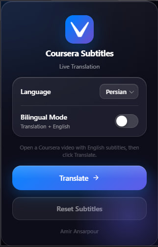

# Coursera Subtitles

A Chrome extension that translates Coursera video subtitles in real time into 31 languages using Google Translate. No account, no API key, no configuration — install it, open a Coursera video, and click **Translate**.



---

## Table of Contents

- [Features](#features)
- [Installation](#installation)
- [How to Use](#how-to-use)
- [How It Works](#how-it-works)
  - [Chrome Extension Architecture](#chrome-extension-architecture)
  - [Reading Subtitles with the TextTrack API](#reading-subtitles-with-the-texttrack-api)
  - [The Translation Pipeline](#the-translation-pipeline)
  - [Chunking Long Videos](#chunking-long-videos)
  - [Concurrent Translation](#concurrent-translation)
  - [Caching](#caching)
  - [SPA Navigation Detection](#spa-navigation-detection)
  - [Message Passing Between Contexts](#message-passing-between-contexts)
- [File Structure](#file-structure)
- [Supported Languages](#supported-languages)
- [Browser Compatibility](#browser-compatibility)
- [Known Limitations](#known-limitations)
- [Contributing](#contributing)
- [License](#license)

---

## Features

- Translates subtitles directly in the browser — no page reload, no external tools
- 31 languages with a searchable dropdown
- **Bilingual mode** — shows the translation and the original English simultaneously
- **Smart caching** — translated subtitles are saved per video; re-translating is instant
- **Parallel translation** — two chunks are translated concurrently, cutting time roughly in half for long lectures
- **Auto-retranslate** — when you move to the next lecture without reloading the page, the extension automatically re-applies the last language you chose
- **In-page toast** — a non-blocking notification confirms translation without interrupting playback
- **Extension badge** — the icon shows "ON" while subtitles are translated, clears on reset

---

## Installation

The extension is not yet on the Chrome Web Store, so it must be loaded manually in Developer Mode.

1. [Download or clone this repository](https://github.com/AmirAnsarpour/Coursera-Subtitles)

   ```bash
   git clone https://github.com/AmirAnsarpour/Coursera-Subtitles.git
   ```

2. Open Chrome and navigate to `chrome://extensions`

3. Enable **Developer mode** with the toggle in the top-right corner

4. Click **Load unpacked** and select the cloned repository folder

5. The extension icon will appear in your Chrome toolbar

No build step is required. The repository contains ready-to-run JavaScript.

---

## How to Use

1. Navigate to any Coursera video lecture
2. Enable **English subtitles** on the video player (the CC button)
3. Click the extension icon in your Chrome toolbar
4. Select your target language from the dropdown (type to filter)
5. Optionally toggle **Bilingual Mode** to show translation + English simultaneously
6. Click **Translate**

A toast notification appears on the Coursera page when translation completes. The popup button changes to **Re-translate** to indicate the extension is active.

To restore the original English subtitles, click **Reset Subtitles**.

---

## How It Works

Understanding this extension requires knowing three browser technologies: the Chrome Extension API, the HTML `TextTrack` API, and the Google Translate endpoint.

### Chrome Extension Architecture

Chrome extensions (Manifest V3) run code in three distinct, isolated environments. Each has different capabilities and a different lifetime:

| Context | File | Runs inside | Lifetime |
|---|---|---|---|
| **Popup** | `popup.html` / `js/popup.js` | Extension popup window | While the popup is open |
| **Content Script** | `js/content.js` | The Coursera tab | While the tab is open |
| **Service Worker** | `js/background.js` | Chrome background | On demand |

These contexts run in complete isolation — they do not share memory, variables, or function scope. The only way they communicate is through Chrome's message-passing API.

This separation explains a design decision that might otherwise look strange: `background.js` exists despite containing only a few lines. The content script cannot call `chrome.action` (the badge API) directly — that API is not available in content scripts. So it sends a message to the service worker, which calls it on its behalf.

### Reading Subtitles with the TextTrack API

Browsers expose subtitle data through the [TextTrack API](https://developer.mozilla.org/en-US/docs/Web/API/TextTrack). Every `<video>` element with captions has a `textTracks` list. Each track contains `VTTCue` objects — one per subtitle line — with the properties that matter here:

```
cue.startTime  →  when to show the subtitle (seconds from video start)
cue.endTime    →  when to hide it
cue.text       →  the subtitle string (readable and writable)
```

Because `cue.text` is writable, the extension replaces subtitle content in place. The browser automatically shows and hides the modified cues at the correct timestamps — no custom rendering or DOM injection needed.

Coursera loads cue data lazily: cues are only fetched from the server when the track mode is set to `"showing"`. The extension forces this, then polls every 100 ms until cues are available (or 8 seconds have passed):

```js
enTrack.mode = "showing";

await new Promise((resolve) => {
  const deadline = Date.now() + 8000;
  const id = setInterval(() => {
    if ((enTrack.cues && enTrack.cues.length > 0) || Date.now() >= deadline) {
      clearInterval(id);
      resolve();
    }
  }, 100);
});
```

Polling is used instead of a fixed delay because cue loading time varies — polling resolves as soon as the data is ready rather than always waiting the worst case.

### The Translation Pipeline

Translating each cue as a separate HTTP request would generate hundreds of API calls for a typical lecture. Instead, the extension concatenates all cue texts into a single string with indexed markers between them:

```
"0 Welcome to the course 1 In this lesson we cover arrays 2 Let's begin 3"
```

Each marker precedes its cue, and one final sentinel marker closes the last
cue's range. `n` (Mathematical White Square Brackets, Unicode U+27E6 and
U+27E7) are chosen as markers for three reasons:

1. They never appear in natural subtitle text
2. Google Translate preserves them verbatim — they are not treated as translatable content
3. They are visually unambiguous in source code, unlike `[n]` which could appear in content or be confused with array notation

The full string is sent to the translation API. After translation, the markers are used to slice the result back into individual cues:

```js
for (let i = 0; i < cues.length; i++) {
  const sm = `${i}`;
  const em = `${i + 1}`;

  const si = translated.indexOf(sm);
  const ei = translated.indexOf(em);

  const raw = (ei !== -1
    ? translated.substring(si + sm.length, ei)
    : translated.substring(si + sm.length)).trim();

  cues[i].text = bilingual ? raw + "\n" + originalCues[i] : raw;
}
```

### Chunking Long Videos

The Google Translate `gtx` endpoint enforces a character limit of approximately 4,500 characters per request. A typical 60-minute lecture can generate well over 50,000 characters of subtitle text.

The concatenated string is split into chunks at cue boundaries — never mid-cue, so the marker parsing works identically whether there is one chunk or twenty:

```js
const chunks = [];
let current  = "";

for (const segment of segments) {
  if (current.length > 0 && current.length + segment.length > CHUNK_SIZE) {
    chunks.push(current);
    current = "";
  }
  current += segment;
}
if (current) chunks.push(current);
```

After all chunks are translated, they are joined back into a single string before the marker-parsing step. From the parser's perspective, the input is always one continuous string.

### Concurrent Translation

Chunks are translated two at a time using a worker-pool pattern. A shared `nextIndex` counter lets each worker atomically claim the next available chunk:

```js
async function translateChunks(chunks, lang) {
  const results = new Array(chunks.length);
  let nextIndex = 0;

  async function worker() {
    while (nextIndex < chunks.length) {
      const i  = nextIndex++;           // claim a chunk
      results[i] = await fetchWithRetry(chunks[i], lang);
    }
  }

  await Promise.all(
    Array.from({ length: Math.min(CONCURRENCY, chunks.length) }, worker)
  );
  return results;
}
```

Because JavaScript is single-threaded, `nextIndex++` is not subject to race conditions — no two workers can claim the same index. Concurrency is set to `2`, which roughly halves translation time without meaningfully increasing the chance of hitting rate limits.

Each chunk is retried up to two times on failure, with exponential backoff (500 ms, then 1 000 ms).

### Caching

Translated cues are stored in `chrome.storage.local` under a composite key:

```js
const cacheKey = `${location.href}|${targetLang}|${bilingual}`;
```

When the user translates the same video and language again — after reset, after a page reload, or in a new session — the cache is checked before any network requests are made. If a valid entry exists (less than 7 days old), the cues are applied immediately from cache.

The cache is capped at 100 entries. When the limit is reached, the entry with the oldest timestamp is evicted before the new entry is written.

### SPA Navigation Detection

Coursera is a single-page application. When you click the next lecture, the browser URL changes and the page content updates, but there is no full page reload. This means:

- The content script remains alive in memory across lecture navigations
- `originalCues` from the previous lecture is still set, but now stale
- Without detection, the extension would silently apply the wrong translations

The extension detects URL changes using two approaches in order of preference:

**1. Navigation API** (Chrome 102+):

```js
navigation.addEventListener("navigate", (e) => {
  if (e.destination.url !== lastUrl) {
    lastUrl = e.destination.url;
    handleNavigation();
  }
});
```

**2. MutationObserver fallback** — Coursera updates `<title>` on every navigation. Watching the title element is a reliable fallback that avoids monkey-patching `history.pushState`, which is fragile and can conflict with other extensions:

```js
new MutationObserver(() => {
  if (document.title !== lastTitle) {
    lastTitle = document.title;
    if (location.href !== lastUrl) {
      lastUrl = location.href;
      handleNavigation();
    }
  }
}).observe(document.querySelector("title"), { childList: true });
```

On every detected navigation: `originalCues` is cleared, the badge is reset, and — if the user had previously translated in this session — a new translation is scheduled automatically after a 3-second delay to allow the incoming video to load.

### Message Passing Between Contexts

Here is the complete flow from a button click to translated subtitles appearing on screen:

```
1. User clicks "Translate" in the popup
   └── popup.js sends: { method: "translate", bilingual: false }
       to the active Coursera tab via chrome.tabs.sendMessage()

2. content.js receives the message and calls openBilingual()
   ├── Locates the <video> element and its English TextTrack
   ├── Forces the track to load, then polls until cues appear
   ├── Checks chrome.storage.local for a cached translation
   ├── On cache miss: chunks the cues, translates concurrently,
   │   writes results back to cue.text for each cue
   └── Calls sendResponse({ status: "done" })

3. Back in popup.js (sendMessage callback)
   └── Updates the button to "Re-translate" and shows the status hint

4. content.js also sends: { method: "badge", text: "ON" }
   └── background.js receives it and calls:
       chrome.action.setBadgeText({ text: "ON" })
```

---

## File Structure

```
coursera-subtitle-translator/
│
├── images/
│   ├── 16.png            Toolbar icon (16×16)
│   ├── 32.png            Toolbar icon (32×32)
│   ├── 48.png            Extensions page icon (48×48)
│   ├── 128.png           Chrome Web Store icon (128×128)
│   └── Extension.jpg     Screenshot used in this README
│
├── css/
│   └── popup.css         All popup styles (iOS 26-inspired dark glass theme)
│
├── js/
│   ├── content.js        Content script — injected into every Coursera tab
│   ├── popup.js          Popup script — UI logic and user interaction
│   └── background.js     Service worker — badge management only
│
├── popup.html            Extension popup markup
└── manifest.json         Extension manifest (Manifest V3)
```

---

## Supported Languages

| Language | Code | Language | Code |
|---|---|---|---|
| Arabic | `ar` | Korean | `ko` |
| Bulgarian | `bg` | Norwegian | `no` |
| Catalan | `ca` | Persian | `fa` |
| Chinese (Simplified) | `zh-CN` | Polish | `pl` |
| Chinese (Traditional) | `zh-TW` | Portuguese | `pt` |
| Czech | `cs` | Romanian | `ro` |
| Danish | `da` | Russian | `ru` |
| Dutch | `nl` | Spanish | `es` |
| English | `en` | Swedish | `sv` |
| Finnish | `fi` | Thai | `th` |
| French | `fr` | Turkish | `tr` |
| German | `de` | Ukrainian | `uk` |
| Greek | `el` | Vietnamese | `vi` |
| Hindi | `hi` | | |
| Hungarian | `hu` | | |
| Indonesian | `id` | | |
| Italian | `it` | | |
| Japanese | `ja` | | |

---

## Browser Compatibility

| Browser | Support |
|---|---|
| Chrome 102+ | Full support |
| Edge (Chromium) | Full support |
| Firefox | Not supported |
| Safari | Not supported |

Chrome 102 is the minimum version because the [Navigation API](https://developer.mozilla.org/en-US/docs/Web/API/Navigation_API) used for SPA navigation detection shipped in that version. A `MutationObserver`-based fallback covers older versions.

---

## Known Limitations

**Unofficial API.** The extension uses Google Translate's unofficial `gtx` endpoint. It requires no API key and works without a Google account, but it is undocumented — Google could change or remove it without notice, and it may rate-limit heavy use.

**English-only source language.** The extension always translates from English. Courses that have only non-English or auto-generated subtitles are not supported.

**Coursera only.** The content script is injected exclusively on `coursera.org`. Supporting other platforms (Udemy, edX, YouTube) requires adding them to `content_scripts.matches` in `manifest.json` and writing platform-specific track-detection logic, since each player exposes subtitles differently.

**Lazy cue loading.** Some Coursera videos do not make subtitle cues available until playback has started. If you see the error toast saying cues are not loaded, press play for a moment and click Translate again.

---

## Contributing

Pull requests are welcome. For significant changes, please open an issue first to discuss the approach.

---

Telegram: [@AmirAnsarpour](https://t.me/AmirAnsarpour) (for support and feedback)
